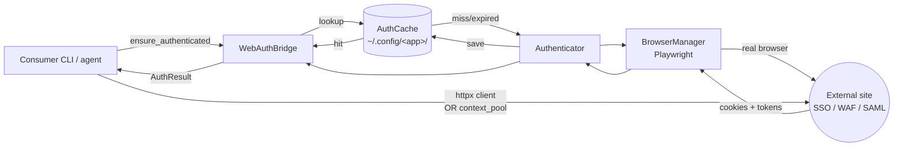
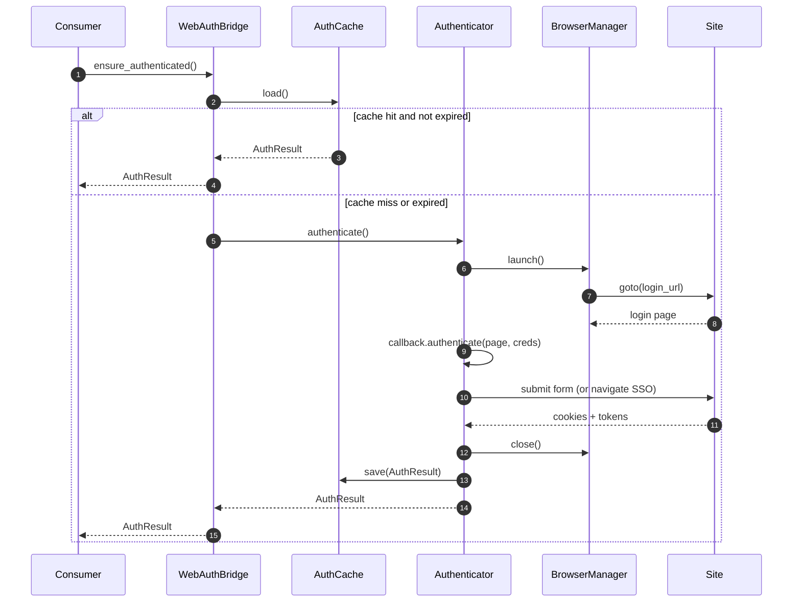
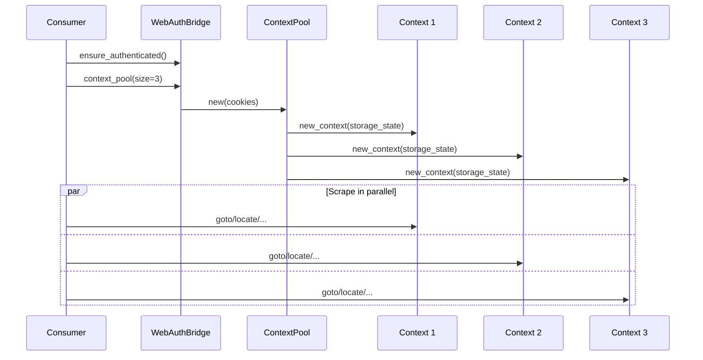

# Architecture

`web-auth-bridge` sits between consumers (CLI tools, agents, scripts) and
websites that cannot be authenticated with plain HTTP.  It uses a real
browser (Playwright) for the login step only, extracts cookies and tokens,
and hands them back as plain data the consumer can reuse for fast HTTP
calls or spawn into parallel headless browser sessions.

## High-level flow



## Components

| Component        | Module                                | Responsibility                                                              |
| ---------------- | ------------------------------------- | --------------------------------------------------------------------------- |
| `WebAuthBridge`  | `web_auth_bridge.bridge`              | Public façade. Orchestrates cache → auth → accessors.                       |
| `Authenticator`  | `web_auth_bridge.auth.authenticator`  | Runs the consumer's `AuthCallback` inside a Playwright context.             |
| `AuthCache`      | `web_auth_bridge.auth.cache`          | JSON-on-disk store keyed by app name. Handles expiry and atomic writes.     |
| `BrowserManager` | `web_auth_bridge.browser.manager`     | Owns the Playwright lifecycle. Applies stealth patches and UA overrides.    |
| `ContextPool`    | `web_auth_bridge.browser.context_pool`| Spins up N parallel headless contexts sharing the authenticated cookies.    |
| `HttpClient`     | `web_auth_bridge.http.client`         | Thin `httpx` wrapper that preloads cookies + optional Bearer tokens.        |
| `AuthCallback`   | `web_auth_bridge.auth.protocols`      | Protocol the consumer implements per site.                                  |

## Authentication flow



## Parallel execution

For sites where no clean HTTP API exists, the consumer can spin up a pool
of headless browsers that all start authenticated:



Each context receives the same cookie jar, so each starts authenticated.
For stateful sessions (ASP.NET-style), the consumer can rotate session
tokens by invoking a site-specific "new session" endpoint inside each
context before issuing real requests.

## Caching

- **Location:** `~/.config/<app>/auth_cache.json` by default (overridable).
- **Format:** JSON blob with `cookies`, `tokens`, `expires_at`.
- **Expiry:** The cache computes its own expiry as the earliest non-session
  cookie expiry, unless the consumer sets `AuthResult.expires_at` explicitly.
- **Invalidation:** `bridge.invalidate_cache()` deletes the file and clears
  the in-memory result. Consumers typically call this on 401/403 and retry.

## Stealth and WAF mitigation

`BrowserManager` applies a documented set of fingerprint patches (see
`_STEALTH_JS` in `browser/manager.py`) to minimise false-positive bot
detection:

- `navigator.webdriver` stripped
- `window.chrome` stub populated
- `navigator.permissions.query` patched for `notifications`
- `navigator.plugins` faked with a realistic PDF viewer
- `screen.colorDepth` / `pixelDepth` corrected from headless defaults
- `navigator.userAgent` scrubbed of `HeadlessChrome`

Headless runs additionally override the UA string to match a real Chrome
build.  When using a real Chrome channel, headed mode skips the override
(the real UA is already authentic), but headless mode still applies it.

## Extensibility

Adding a new site is a matter of implementing the `AuthCallback`
protocol:

```python
class MySiteCallback:
    async def authenticate(self, page, credentials):
        await page.goto("https://example.com/login")
        await page.fill('input[name="email"]', credentials.username)
        await page.fill('input[name="password"]', credentials.password)
        await page.click('button[type="submit"]')
        return AuthResult(tokens={"session_verified": "true"})

    async def is_authenticated(self, auth_result):
        return not auth_result.is_expired
```
